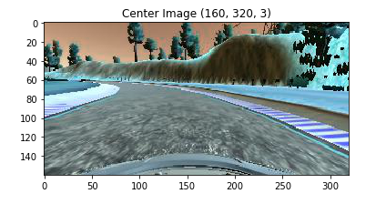
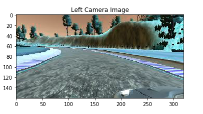
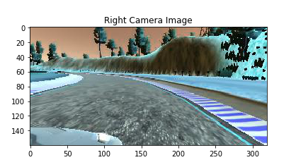
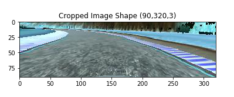
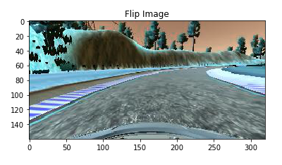
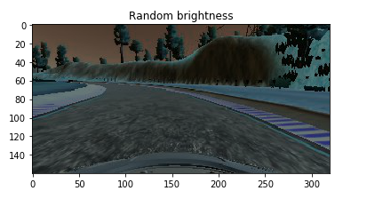
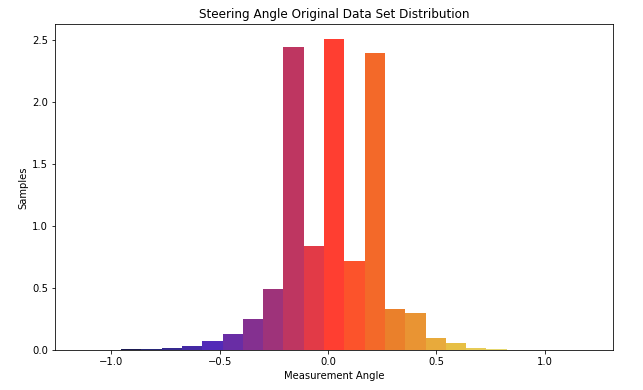
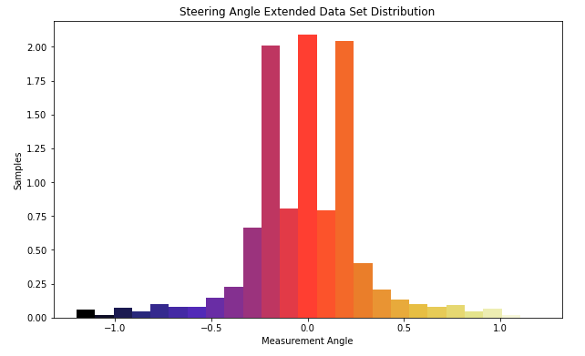
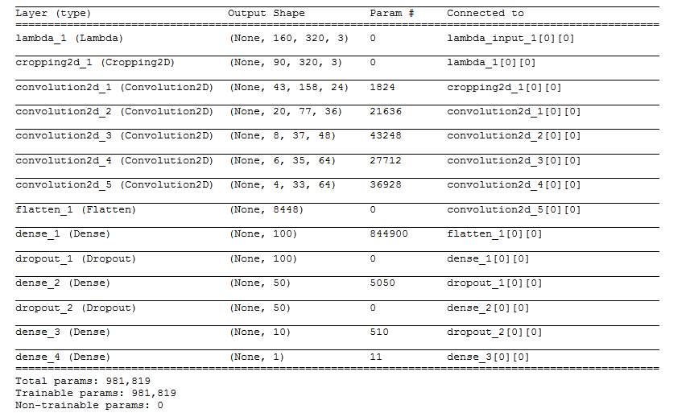
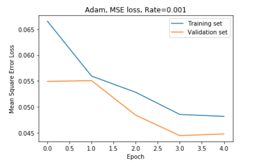

# Behavioral Cloning Project

Background
---

Behavioral Cloning Project is to apply deep learning principle to clone a car driving behavior in simulator. Udacity provided simulator where you can collect data steering angle related to front view camera. 

The simulator consist of training and autonomous mode, and two test track. First track is a lot easier to navigate. Contrary, second track is more challenging with numbers of hard turn and challenging ground. In training mode user collect driving data and images. Data collected are steering angle, throttle, brake speed and associated camera image (center, left and right).

Using the Keras deep learning model, a convolutional neural network (CNN) model is utilized and trained with collected driving data from Udacity combine with extra data collected during project build. Train result saved as model.h5. 

Files included
---

* model.py - script used to create and train the model.
* drive.py - script to drive the car.
* model.h5 - model weights.
* Two video.mp4 - results video on both track under video folder.
* visualization.ipynb - a Jupiter notebook file to visualized some graphic and pictures.
* model.ipynb - a Jupiter notebook version of model.py.

Required libraries
---

* Anaconda or Miniconda
* Tensorflow
* OpenCV
* Keras
* NumPy
* TensorFlow

Data PreProcess
---

Training data visualization is very important step to understand steering measurement data distribution. Additional data was generated and combined with provided data. Final data was pre-process before feed to neural network. 

Below is augmentation process used in this project :

* Random adjust the image brightest/darkness.
* Flip the image and steering angle together.
* Use left camera and steering angle adjusted by +0.2.
* Use right camera and steering angle adjusted by -0.2.
* Crop the image on focus area in the front of vehicle (remove all trees in images).

Collected More Data 
---

Histogram of original training data is displayed below. I decided to collect more training data set on first and second track of simulator. I used USB game controller to drive vehicle in simulator since I found it more convenient.

The goal of extra data set is to balance the distribution of data specifically in more challenging hard turn steering angle generally found on second track. Data then preprocess with methods above before run the training.

Histogram from final data set displayed below.

Model Architecture
---

Model architecture adopted from [nVidia](https://images.nvidia.com/content/tegra/automotive/images/2016/solutions/pdf/end-to-end-dl-using-px.pdf) model. Added two dropout after Dense 1 and 2 seem help to reduce overfitting.  

Adam optimizer was chosen as an optimizer and mean square error for loss function. The reason I stick with Adam can be found in this best [optimizer comparison for regression](https://www.quora.com/Which-optimizer-in-TensorFlow-is-best-suited-for-learning-regression). I used mean square error as suggested [here](https://stackoverflow.com/questions/36515202/why-is-the-cross-entropy-method-preferred-over-mean-squared-error-in-what-cases). Parameter is set to : learning rate 0.001, beta_1=0.9, beta_2=0.999, and epsilon=1e-8. Reference about Adam optimizer on Keras can be found in [here](https://keras.io/optimizers).

Below is screen shot of model architecture :

Training
---
Model trained on variety number of parameter. I took advantage of [Keras fit generator](https://keras.io/getting-started/sequential-model-guide/) to deal with large number of training data by feeding the network in batch. Data is augmented and shuffle before feed to network. I started with original nVidia architecture with 3 number of Epoch. Dropout was introduce after initial run shown the model tend to overfitting.  I settled with learning rate 0.001, beta_1=0.9, beta_2=0.999, and epsilon=1e-8 and Epoch 5. This setting seem to yield better performance.

Result
---

Training result is model.h5 file. To check the performance of training process I run model.h5 file with simulator.
The model able to run vehicle on simulator autonomous mode on both track. Recorded video on both track can be found on videos folder.

To visualize model result run following command :

Without Recording
- python drive.py model.h5 

With recording
- python drive.py model.h5 <target_directory>

To generate video of the model run following command :

- python video.py <target_directory>

Conclusion
---

In this project, I was working on a regression problem in self-driving cars challenge. I mainly focused on utilized a suitable network architecture and trained a model using provided dataset. However additional data set was generated and proven to be helpful to navigate the vehicle on second track. 

Data augmentation is very important to generate uniform data to feed the network. Dropout was also introduce to the model after initial train show over fitting.

Generate you own data set through simulator, apply neural network to produce a trained model is a great experience to have. However I having trouble navigate vehicle in simulator with keyboard or mouse. I have much better handling with USB game controller.  
